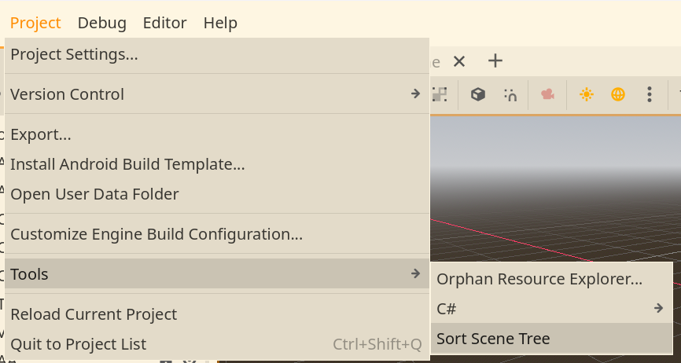
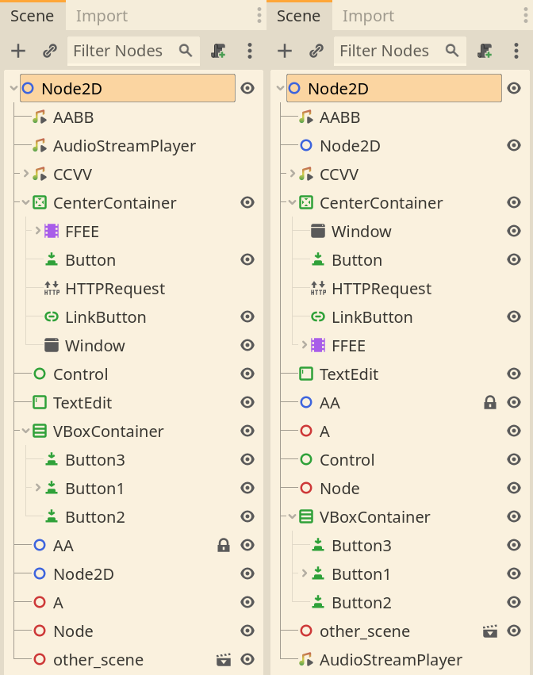

# Scene Tree Sorter - Godot Addon

Scene Tree Sorter is an addon for Godot 4 that automatically sorts the current scene tree.  

It sorts by type, then by name, but does not sort container type nodes, as tree position matters.

## Installation

1. Download the addon from the Release tab or download the code as a zip.
2. Copy the addons folder into your project.
3. Enable the plugin in your project settings. (Project > Project Settings > Plugins > Scene Tree Sorter)

## Usage

The addon adds a button in the Tools subfolder (Project > Tools > Sort Scene Tree).

### After - Before

## Roadmap

- [ ] Sort non-control nodes in container nodes without moving control nodes.
- [ ] Automatically sort each scene in the project files.
- [ ] Sort the scene tree when it opens or closes.

## License

This project is licensed under the terms of the [Mozilla Public License, version 2.0](https://www.mozilla.org/en-US/MPL/2.0/).
